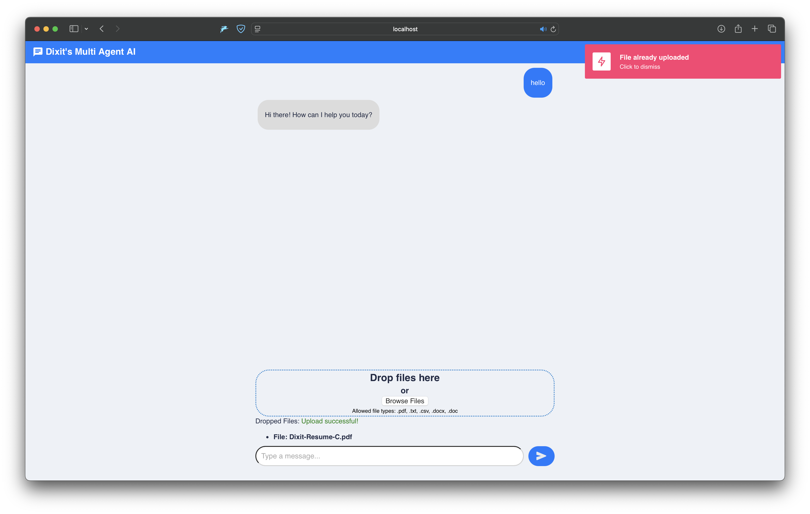
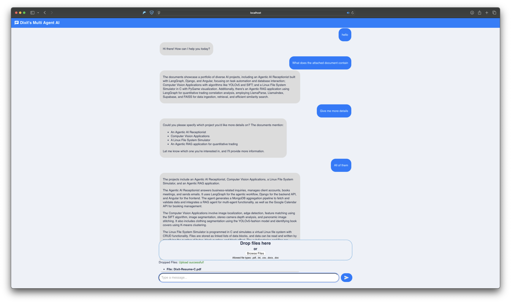

# Agentic RAG

A RAG agent that allows you to query your uploaded documents and/or fetch data from it's pre-loaded knowledge base. Simply upload pdf's, text documents, images etc and start asking questions. 

It can crawl a given url, extract information in markdown format, generate vector embeddings and insert it in a database along with some metadata for metadata filtering when querying.

Built the UI using Angular, the source code for which is in the [AI-Receptionist](https://github.com/sudo-god/AI-Receptionist) repo

###### **A few screenshots of the agent in action:**




## Conda environment

```bash
conda create -n agentic-rag python=3.10
conda activate agentic-rag
```

## Installing requirements

```bash
pip install -r requirements.txt
```

## Installing faiss-cpu
If you encounter an error installing faiss-cpu, you can install it using:

```bash
conda install pytorch::faiss-cpu
```

Rerun the `pip install` command from above to ensure all the dependencies are installed.

## Running the app

```bash
streamlit run main.py
```